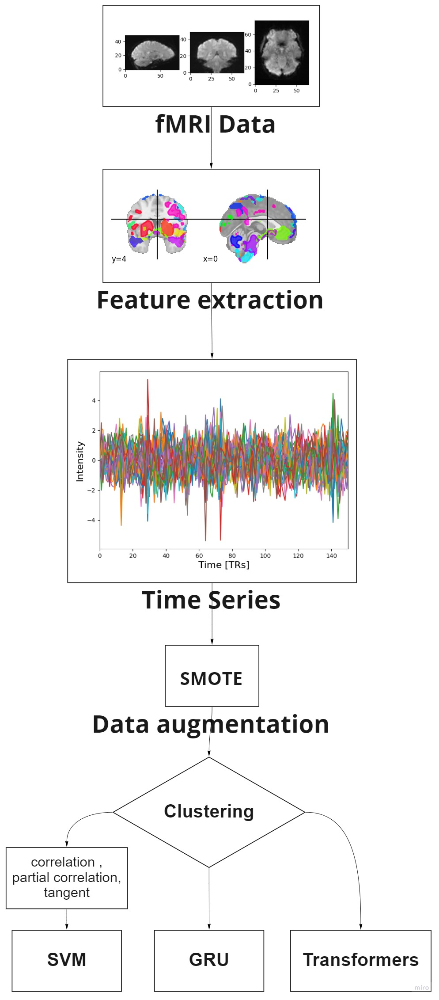
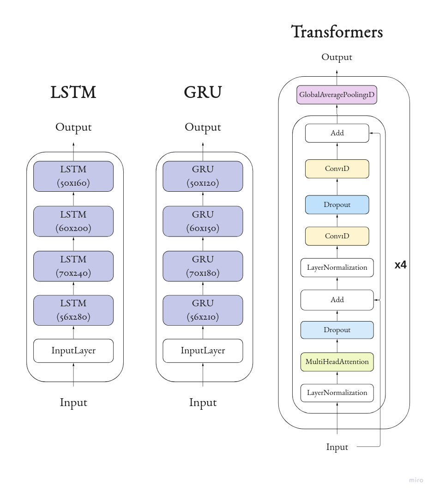
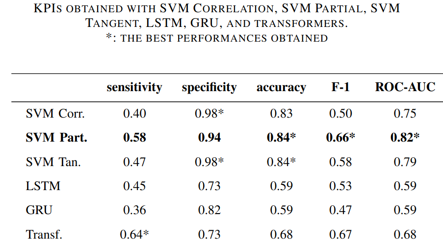

# NeuroClassifier

Starting from fMRI data, Dictionary Learning is used to select the most intensely activated regions and corresponding voxels. To handle class imbalance, SMOTE is applied for data augmentation.

Three correlation connectivity matrices (simple, partial, and tangent) are computed from the extracted time series. These matrices are then classified using Support Vector Machine, while the time series are classified using Long Short-Term Memory, Gated Recurrent Unit, and transformers.

Finally, Key Performance Indicators such as sensitivity, specificity, accuracy, F-1 score, and ROC-AUC are utilized to evaluate the performance.

## Flow

## Networks

## Results

